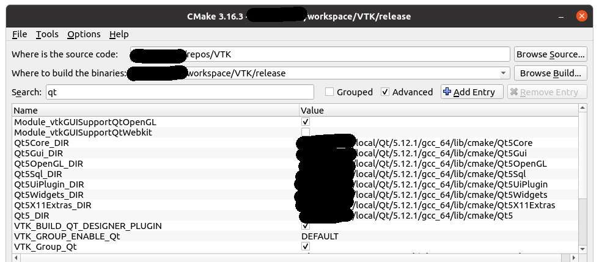
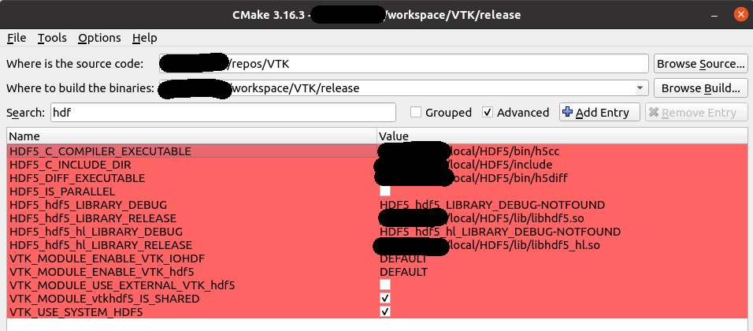

# PRETUS
**P**lug-in based, **Re**al-**t**ime **U**ltra**s**ound

This is a plug-in based, lightweight software for real time image analysis, data collection, and operator guidance, developed within the [iFIND project](www.ifindproject.com). 
PRETUS is a lightweight software that creates, at run-time, a real-time imaging pipeline. 
The program itself does not do much on its own: most functionality is brought in through [plug-ins](src/Plugins) that are conected in sequence in the user-defined pipeline. 
Configuration information as well as data is passed from a plug-in to the next embedded in an object of the `the ifind::Image` class. 
This class, together with convenience readers and writers make up the [Common](src/Common) tools.

### Citations
If you use PRETUS please cite our preprint:
[Alberto Gomez, Veronika A. Zimmer, Gavin Wheeler, Nicolas Toussaint, Shujie Deng, Robert Wright, Emily Skelton, Jackie Matthew, Bernhard Kainz, Jo Hajnal, Julia Schnabel. "PRETUS: A plug-in based platform for real-time ultrasound imaging research", 2021 - arXiv:2109.0651](https://arxiv.org/abs/2109.06519)

```bibtex
@misc{gomez2021pretus,
      title={PRETUS: A plug-in based platform for real-time ultrasound imaging research}, 
      author={Alberto Gomez and Veronika A. Zimmer and Gavin Wheeler and Nicolas Toussaint and Shujie Deng and Robert Wright and Emily Skelton and Jackie Matthew and Bernhard Kainz and Jo Hajnal and Julia Schnabel},
      year={2021},
      eprint={2109.06519},
      archivePrefix={arXiv},
      primaryClass={physics.med-ph}
}
``` 

### Contact
* Lead development: [Alberto Gomez](mailto:alberto.gomez@kcl.ac.uk)
* Support: [pretus@googlegroups.com](mailto:pretus@googlegroups.com).

### Contributors
* Alberto Gomez
* Nicolas Toussaint
* Gavin Wheeler
* Veronika Zimmer

# 1. Quick usage notes

After build and install (see build instructions below), PRETUS can be launched with a convenience bash script:
```
./launch_pretus -h
```

The `-h` option will display the options for the available plugins. 
The actual plugin pipeline can be specified with the `-pipeline` option, and then followed by any plugin-specific options, for example 2 valid calls, and hypothetical associated outputs, would be:
```
./launch_pretus -pipeline "videomanager>standardplanedetection>gui" --videomanager_input /folder1/video.mp4
```


```
./launch_pretus -pipeline "filemanager>pythonalgorithm>cppalgorithm>gui" --filemanager_input /folder2/files/
```


The software will load all plug-ins found in the plug-in folder. 
Such folder can be given a default value at build time (defined through CMake with the variable `PLUGIN_FOLDER`), or can be set at any time in the config file `<$HOME>/.config/iFIND/PRETUS.conf`. 
This configuration file is automatically created the first time the software is run. 
If multiple plug-ins folders are required, they can be colon-separated and within double quotation marks, e.g. the file may look like this:

```
[MainApp]
plugin_folder="folder1/release/lib;/fodler1/subfolder2/lib"
```

## For developers

Functionality is brought in via plug-ins. Al plug-ins must inherit the class `Plugin` in the [PluginLib](src/PluginLib) library.
Please read the documentation for each plug-in in terms of dependencies, build instructions, etc. 
Two plugins ([CppAlgorithm](src/Plugins/Plugin_CppAlgorithm) and [PythonAlgorithm](src/Plugins/Plugin_PythonAlgorithm)) are provided as tutorials to create new ones.
If you would like to contribute to PRETUS, please read the [contribution guidelines](docs/CONTRIBUTING.md).

# 2. Building PRETUS from source
PRETUS is currently provided as source code only, so users must build it. 
Follow the instructions below and if you have trouble please get in touch using the users group:  [pretus@googlegroups.com](mailto:pretus@googlegroups.com).

## Dependencies
The requirements are:  
* CMake 3.15
* Qt 5 (5.12)
* HDF5 1.10.4
* VTK 8.2.0
* OpenCV 3.4.4
* ITK 5.1.2
* Boost 1.71
* GCC 8.4
* Anaconda
* PyBind11

Below the order of building and whether other versions might work is indicated.

## Build instructions
We suggest installing CUDA, then python and python dependencies , then C++ dependencies, and then building PRETUS itself.

### Installing CUDA
CUDA is only required to run some of the plug-ins in the GPU, specifically those using deep learning models via tensorflow or pytorch. 
We have tested with [CUDA 10.2](https://developer.nvidia.com/cuda-10.2-download-archive). 
When modern GPUs are available, more modern versions of CUDA (11+) are preferred.

### Python dependencies
Python is not required to build PRETUS, however it is recommended and required for many plug-ins, such as `Plugin_pythonaAlgorithm` and `Plugin_standardPlaneDetection`. 
As a result, we suggest to start by installing python with conda, then creating a virtual environment for PRETUS, and finally installing the required packages within the `pretus` environment using `pip`:

#### Step by step installation
1. Install `Anaconda`, following the instructions from [here](https://docs.anaconda.com/anaconda/install/linux/).
2. Install pip:

    ```
    conda install pip
    ```
3. Create an environment for PRETUS using python 3.7

    ```
    conda create --name pretus python=3.7
    ```
4. Install required python packages. We provide a `requirements_low.txt` file that can be used for systems with a *low* performance graphics card (tested with GeForce GTX 960M):

    ```
    conda activate pretus
    pip install -r pretus/src/Plugins/requirements_low.txt
    ```

You can install the required packages manually. The main ones to install, and their versions, are:

* dill==0.3.4
* h5py==2.10.0
* json5==0.9.6
* Keras==2.3.1
* matplotlib==3.4.3
* numpy==1.21.4
* opencv-python==4.5.4.58
* pandas==1.3.4
* Pillow==8.4.0
* scikit-image==0.18.3
* scikit-learn==1.0.1
* scipy==1.7.2
* SimpleITK==2.1.1
* tensorflow-gpu==1.14.0
* torch==1.10.0 (installed for the corresponding CUDA version, in this case 10.2)
* torchvision==0.11.1

#### Direct installation
If you are in Ubuntu 20.04x64, you can follow conda installation of the [virtual-environment](dependencies/virtual-environment).

### C++ dependencies
The dependencies should be built in the following order.  
The build instructions and options assume, unless otherwise stated, that each library will be build from source using CMake and that the required options are CMake options.

Pre-requisites (likely already in your system!):

* Boost
    * Tested with 1.71.0
    * No need to build from source, use the package manager to install the latest version. See further instructions for [Ubuntu 20.04x64](https://www.devmanuals.net/install/ubuntu/ubuntu-20-04-focal-fossa/installing-libboost-all-dev-on-ubuntu20-04.html).
*  gcc
    * Tested with 8.4.0
    * No need to build from source, use the package manager instead. You might need to switch to another version of [gcc](https://linuxconfig.org/how-to-switch-between-multiple-gcc-and-g-compiler-versions-on-ubuntu-20-04-lts-focal-fossa).

### Actual requirements and build order
* CMake 3.15 (versions >= 3.10 might work) this can be installed from a package manager. CMake-gui is recommended.  
* Qt 5 (versions >= 5.12 might work). Installing binaries from the web based installer using the manager tool is recommended. 
  The installer, `qt-unified-linux-x64-4.2.0-online.run` can be downloaded from [here](https://download.qt.io/archive/online_installers/4.2/) and you need to create your Qt account to be able to install it.
* [HDF5](https://github.com/HDFGroup/hdf5)
  * Download and clone
  ```bash 
  ## Cloning repo and checking out version
  mkdir -p $HOME/repositories/ && cd $HOME/repositories/
  git clone git@github.com:HDFGroup/hdf5.git HDF5
  cd $HOME/repositories/HDF5
  git checkout tags/hdf5-1_13_0 
  
  ## Creating paths 
  mkdir -p $HOME/repositories/HDF5/build && cd $HOME/repositories/HDF5/build
  mkdir -p $HOME/workspace/HDF5/release
  mkdir -p $HOME/local/HDF_Group/HDF5/1.13.0
  cmake-gui ../HDF5
  ```
  
  * `hdf5` should be built from source (tested version 1.10.4, other versions might work). The following CMake options should be enabled:
    * set `HDF5_GENERATE_HEADERS` to be `ON`.
    * set `HDF5_BUILD_CPP_LIB` to be `ON`.
    * set the `CMAKE_INSTALL_PREFIX` to a specific location. Recommended a local folder, for example `$HOME/local/HDF_Group/HDF5/1.13.0`.
    Configure and generate in your CMake-gui, then go to the build folder and in a terminal do `make && make install`.

* [VTK](https://gitlab.kitware.com/vtk/vtk)
  * Download and clone
  ```bash 
  ## Cloning repo and checking out version
  mkdir -p $HOME/repositories/ && cd $HOME/repositories
  git clone https://gitlab.kitware.com/vtk/vtk VTK
  
  cd $HOME/repositories/VTK
  git checkout tags/v8.2.0
  git submodule init
  git submodule update
  
  ## Creating paths
  mkdir -p $HOME/workspace/VTK/release
  cd $HOME/workspace/VTK/release
  rm -rf *
  mkdir -p $HOME/repositories/VTK/build && cd $HOME/repositories/VTK/build
  cmake-gui ../VTK
  ```
  * `vtk` should be built from source (tested version 8.2.0., other versions might work). The following CMake options should be enabled:
    * `VTK_LEGACY_SILENT` CMake flag to `ON`
    * Activate `VTK_Group_Qt`, `vtkGUISupportQtOpenGL`, `vtkImagingOpenGL2`
    * Set the `Qt5_DIR` variable to where Qt is installed, for example `<homefolder>/local/Qt/5.12.1/gcc_64/lib/cmake/Qt5`. Make sure that all QT directories point at the downloaded QT installation, as in the figure:
    
    * `CMAKE_CXX_FLAGS` set to `-std=c++14 -fPIC`
    * `VTK_MODULE_ENABLE_VTK_libxml2` set to `NO` (if you don't see this flag, ignore this step)
    * Activate `VTK_USE_SYSTEM_HDF5`, and and set each HDF5-related folder to the subfolders of the HDF5 installation i.e. `<home>/local/hdf5/...`, as follows:
    
    * Go to the build folder, in a terminal do `make`.
* [OpenCV](https://github.com/opencv/opencv) and [OpenCV contrib](https://github.com/opencv/opencv_contrib), Tested with 3.4.4. Higher versions might work. TO build and install follow these steps: 
	
    Download and clone opencv:  
   ```bash
    git clone https://github.com/opencv/opencv.git
    cd opencv
    git checkout 3.4.4
    cd ..
    ```

    Download opencv_contrib from Github:
    ```bash	
    git clone https://github.com/opencv/opencv_contrib.git
    cd opencv_contrib
    git checkout 3.4.4
    cd ..
    ```
	* Version 3.4.4 seems to have a bug that prevents from building `cvv` (which is required!). The fix is the following: In the file `modules/cvv/src/qtutil/filter/diffFilterWidget.cpp`, line 68, you need to replace
	
	``` 
	  cv::cvtColor(in.at(0).get(), originalHSV, COLOR_BGR2HSV);
      cv::cvtColor(in.at(1).get(), filteredHSV, COLOR_BGR2HSV);
   ```
   
   with 
   
   ```
   cv::cvtColor(in.at(0).get(), originalHSV, cv::COLOR_BGR2HSV);
   cv::cvtColor(in.at(1).get(), filteredHSV, cv::COLOR_BGR2HSV);
   ```
   
   And it should work.
   
	4.3 Make sure you have opencv dependencies:
	* gstreamer-1.0 (by doing, in a terminal `sudo apt-get install libgstreamer-plugins-base1.0-dev`)
	* jpeg (by doing, in a terminal `sudo apt-get install libjpeg-dev`)
	* tiff (by doing, in a terminal `sudo apt-get install libtiff-dev`)
	* png (by doing, in a terminal `sudo apt-get install libpng-dev`)
	* DC1394 video codecs (by doing, in a terminal `sudo apt-get install libdc1394-dev`)
	* NOTE: Some users have found problems finding ffmpeg. This remains unsolved for now.
	
    Configure opencv, setting the following CMake variables:  
    * `HDF_DIR` to the install cmake location:  `<home>/local/hdf5/share/cmake/hdf5`
    * `OPENCV_EXTRA_MODULES_PATH` to the source code where opencv_contrib is cloned, e.g. `<path to repos>/opencv_contrib/modules`
    * `WITH_VTK` enabled and `VTK_DIR` to the VTK build directory
    * `WITH_QT` enabled and the `QT_DIR` to the Qt directories of the QT installation (as with VTK).
    * set the `CMAKE_INSTALL_PREFIX` to a specific location. Recommended a local folder, for example `<home>/local/opencv`.
    * Go to the build folder, in a terminal do `make && make install`.
	
* [ITK](https://github.com/InsightSoftwareConsortium/ITK), tested with version 5.1.2, should also work with previous versions >= 4.9.1 with c++14 enbled. : Set the following CMake flags:
    * `ITKVideoBridgeOpencv` option `ON`, and the `OpenCV_DIR` ser to the install path, for example `<home>/local/opencv/share/OpenCV`.
    * Enable `ITKVtkGlue`, and set the `VTK_DIR` to the build folder for VTK.
    * `VNL_CONFIG_LEGACY_METHODS` set to OFF
    * Use system hdf5, and set each HDF5-related folder to the subfolders of the HDF5 installation i.e. `<home>/local/hdf5/...`.
    * Go to the build folder, in a terminal do `make`.
    
* [PyBind11](https://github.com/pybind/pybind11), tested with version 2.8.1. In the CMake, the python version used throughout must be indicated. 
    It is recommended that this is version 3.7 installed with anaconda, in the environment prepared for pretus:
    * `PYTHON_EXECUTABLE` set to `<home folder>/anaconda3/envs/pretus/bin/python3.7m`
    * `PYTHON_LIBRARY` set to `<home folder>/anaconda3/envs/pretus/lib/libpython3.7m.so`
    * `USE_PYTHON_INCLUDE_DIR` set to `ON`
    * set the `CMAKE_INSTALL_PREFIX` to a specific location. Recommended a local folder, for example `<home>/local/pybind11`.
    * Go to the build folder, in a terminal do `make && make install`.


### Building PRETUS

At this stage you can enable and disable what plug-ins will be built. See plug-in specific instructions on how to configure CMake options for them. 
If you have external plug-ins built somewhere else, you need to specify the plug-ins build folder in the CMake entry `PLUGIN_FOLDER`. 
These can be more than one folder, separated by `;`. 
These folders can also be set after build in the config file (```<$HOME>/.config/iFIND/PRETUS.conf```) as described at the top of this document.

Set your install path using the `CMAKE_INSTALL_PREFIX` variable. We recommend a path within `<HOME>/local/`. 
And select the plug-ins to build with `BUILD_PLUGIN_XXX`. 
We recommend to initially build with the default enabled plug-ins, and gradually build the rest to isolate potential build errors.

* Generate using CMake.  At this stage, you *might* get some errors or warnings. 
  If there is an error about conflicting library versions with conda, make sure you select the anaconda versions on CMake.
* Set the `CMAKE_INSTALL_PREFIX` to a specific location. Recommended a local folder, for example `<home>/local/pretus`.
* Go to the build folder in the terminal, do `make`, and `make install`. 
  The `install` step is mandatory for if you use Python plug-ins (else PRETUS will not find the python sources)


Launch `./launch_pretus -h` from your install location.

### Notes

Each plug-in may have additional dependencies, so please do check the README in each Plug-in folder for specific build instructions. 
More comprehensive instructions, and troubleshooting, can be found [here](src/troubleshooting.md).

# Acknowledgement
This work was supported by the Wellcome Trust IEH Award [102431], by the Wellcome/EPSRC Centre for Medical Engineering [WT203148/Z/16/Z], by the National Institute for Health Research (NIHR) Biomedical Research Centre at Guy's and St Thomas' NHS Foundation Trust and King's College London. 
The views expressed are those of the author(s) and not necessarily those of the NHS, the NIHR or the Department of Health.