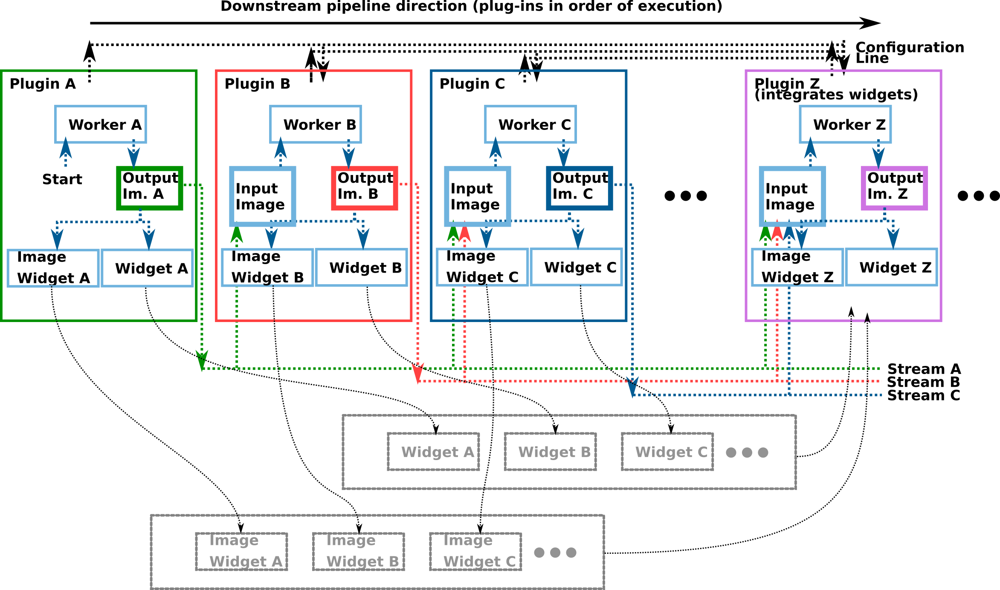

# Plug-ins

Author: Alberto Gomez (alberto.gomez@kcl.ac.uk)

# Summary

Plug-ins bring the functionality into the software and can be connected in sequence. All plug-ins inherit from the class [`Plugin`](Plugin.h). This class implements basic operations such as reding arguments from the comand line and receiving configuration parameters, however the actual functionality of the plug-in must be implemented in a separate class, inheriting from [`Worker`](Worker.h). This allows to properly execute the task on a separate, concurrent thread. Plug-ins may optionally implement a graphical interface to display information on a widget. This widget must inherit from the [`QtPluginWidgetBase`](QtPluginWidgetBase.h) class. A number of convenience widget components are included here, and described below.

See the architecture notes below to understand how they work and how to create your own plug-ins. Feel free to use the available plug-ins as templates or examples. The `Plugin_CppAlgorithm` is a good place to start for a simple plug-in template.

# Overview of the plug-in pipeline system and data streams

PRETUS interconnects plug-ins in a user-specified order, forming a pipeline. The first plug-in will normally generate images at a certain frame rate (for example, capturing images from a frame grabber or reading images from disk). An overview of the software is shown in the figure below:



In summary, plug-ins have a forward configuration line (black, top) where any plug-in can share with  downstream plug-ins configuration information, at startup, or at any given time. Then, at a certain frame rate, plugins read any images being transmitted in the data line (bottom) and inject their outputs as a new stream in the data line. All transmissions (configuration and data) are carried out using QT signals and slots. This is explained  below in more detail.

## Pipeline creation, configuration and software start-up

The main application is implemented in a `QApplication` object.

When user launches the program, a QApplication is created and then the pipeline is formed and the following events ocur, in order:

1. The constructor of every plug-in is called
2. Each plug-in is passed any extra command line arguments
3. A **forward configuration line** between plug-ins is established. As a result, if a plug-in generates configuration data, all plug-ins that are located after it in the pipeline will receive configuration information from that plug-in.
4. A **forward data line** between plug-ins is established. As a result, every time a plug-in generates an image, all plug-ins located after it in the pipeline will receive it. As described later, all images are tagged with a *stream* type, and the received images will be ignored by a plug-in if the plug-in is not configured to process images from that *stream*.
5. Any plug-in in the pipeline that can render widgets is passed a list with the widgets of all plug-ins that implement a widget, as well as a prefered location to display them.
6. All the plug-ins are *initialized* in order (their `Initialize()` method is called). This is normally when after initializing all class members a plug-in will emit configuration information downstream the pipeline, if relevant.
7. Last, and after all plug-ins have been initialized, all plugins are *activated*. For most plug-ins this will have no effect since they are active by default, but typically this triggers the first plug-in to start the acquisition process, and causes the image stream to start flowing between plug-ins.

## Streams
One of the key features of the software is the concept of *streams*. A stream is a sequence of data produced by a plug-in in real-time. Streams have the following properties:

* Streams are named after the plug-in that generates it.
* A plug-in can "inject" a new piece of data into its stream after it has processed an input image. Therefore, the resulting stream might not have a uniform frame rate.
* A plug-in has access to all streams that are generated before that plug-in in the pipeline, and not just the stream from the plug-in immediately before it. 
* Similarly, multiple plug-ins can use the same stream.


# Intra-plugin details: Interaction between the `Plugin`, the `Worker` and the `Widget`

# Plug-ins using python

 

* Python library, and include dir. These should be the same used in all packages, and for simplicity we recommend choosing the anaconda packages (e.g. `<homefolder>/anaconda3/lib/libpython3.7m.so` for the python library, and so on).
* PyBind11


# Widget options


# Creating a new plug-in

---


# Passing information between plug-ins

The system is designed to work as a linear succession of plug-ins, with a *real-time* stream where minimal processing is done (basically, image data is passed from one plug-in to the next), and a number of concurrent background processes that asynchronously inject processed images into the real-time stream, creating data streams of different types, interleaved into the real time stream.

## Concurrent image streams

Every image that is acquired is passed on from the first plug-in, to the next through the real-time path until it reaches the last plug-in. This is done by every plug-in emiting the signal `ImageGenerated(image);` which is connected to the slot `slot_imageReceived(ifind::Image::Pointer image)` of the next plug-in. This slot does the following:

```c++
    /// Send the image for processing. This image may or may not
    /// be processed depending on the timer's frame rate
    if (this->IsOfExpectedStreamType(image)){
        this->Timer->SetIfindImage(image);
    }

    /// Send the image through the pipeline
    Q_EMIT this->ImageGenerated(image);
```

So images are  passed on to the next plug-in, and passed to the current plug-in's `Timer`. This `Timer` object calls the `worker` of the plug-in at regular intervals to process the image. A plug-in can restrict the type of stream it operates on by re-implementing the virtual method ` virtual bool IsOfExpectedStreamType(ifind::Image::Pointer image);`.

For the plug-in to emit a signal with the processed image, the the plug-in parent class implements, in initialization:

```c++
QObject::connect(this->worker.get(), &Worker::ImageProcessed,
                     this, &Plugin::slot_imageProcessed);
```


## Background execution for plug-ins

Plug-ins, through workers, can execute the task in the background without blocking the real time stream. This is achieved through a number of mechanisms that enable that lengthy processes are either buffered (so that all processed frames are sooner or later injected in the stream) or that some frames are dropped to ensure that regardless of how long the processing takes every time a new processing task starts it works on the most recent frame availeble. These mechanisms, implemented via signalsand slots, are the following:


1. A `Timer` class sends the image that has been most recently received by the plug-in to the worker at a  user-defined frame rate. For this, the plug-in `Plugin::Initialize` method implements:

    ```
     this->setFrameRate(20); // fps
     this->Timer->SetDropFrames(true); // if false, processings are buffered
     QObject::connect(this->Timer, &ifindImagePeriodicTimer::ImageReceived,
                         this->worker.get(), &WorkerType::slot_Work);
    ```

2. The `Worker` emits a signal to notify that the processing has finished and this is captured by the `Timer`, that knows that (only if frame dropping is activated) needs to wait for this signal before sending a new image to the worker. This is implemented in the plug-in `Plugin::Initialize` method:

    ```
     QObject::connect(this->worker.get(), &WorkerType::WorkFinished,
                         this->Timer, &ifindImagePeriodicTimer::ReadyToShootOn);
    ```

3. The worker carries out its task in a background thread. This is achieved with:

    ```
    QObject::connect(&this->workerThread, &QThread::finished,
                     this->worker.get(), &QObject::deleteLater);
    this->worker.get()->moveToThread(&this->workerThread);
    workerThread.start();
    ```

All the above is already implemented in the `Plugin` parent class, in the `Initialize` method. As a result, this does not need to be re-implemented, **as long as the user's plug-in `Plugin_XXX` calls the parent's function in it's `Initialize` method**:

```c++
void Plugin_XXX::Initialize(void){
    
    Plugin::Initialize();  // <----------
    
    this->worker->Initialize();
    // Do some plug-in specific initializations
    // ...
    ifind::Image::Pointer configuration = ifind::Image::New();
    // ....
    Q_EMIT this->ConfigurationGenerated(configuration);

    this->Timer->Start(this->TimerInterval);
}
```


## Order of object creation

First, the plug-ins are loaded, with the `PluginQList plugin_list = LoadPlugins(argc, argv);` call. This triggers **(1) the plug-in constructor**, and **(2) passing the command line arguments to the plug-in**. After this, the plug-ins are **(3) connected** and then **(4) initialized**. In initialization the configuration is passed on to the next plug-in, so the next plug-in should receive the configuration *before* its initialization. Last, the plug-ins are **(4) activated with the `Set Activate(true)`** method.


# I AM HERE --------------


## The background path

The task to be carried out by a plug-in (normally by its worker) is carried out in the background at a user-defined frame rate. The work is triggered by the `Timer`. The real-time path passes every image to the`Timer` as shown above, and the `Timer` calls the worker with the most recent image available at a guiven frame rate. When the work is done, the result, encoded in a *processed* data, is injected back into the real-time path in the first next image to be received, which we will call the *carrier* image. This may cause dissinchrony between the *carrier* image and the *processed* data.

## Dealing with Disynchrony between the carrier image and the processed data.

Assuming we can't speed up the workers' tasks to remove this disynchrony, we can however ensure that we inject consistent information into the real-time path by making that the *processed* data contains the results of the process but also the inputs to that process. For example, in the case of a standard view detector, the processed data would contain the detected plane name and also the input image that was passed to the plane detector, which may or (most likely) may not be the carrier image this information is attached to.


The way the above solution is implemented is as follows: every plug-in will have a `PluginData` object. This object will contain two objects: `PluginInput` and `PluginOutput`. This `PluginData` will be attached to the carrier `ifind::Image` in real time.

Internally, these data will be stored by the worker as a set of image(s) and meta data key(s), in the member `ifind::Image::Pointer LatestOutputImage`. This enables easy save to disk if required. However, for the user the interface to read this information is, for example:

```c++
ifind::Image::Pointer pluginData = carrierImage->GetPluginData("Biometrics");

int n_inputs_biometrics = biometricPluginData->GetNumberOfInputs("Biometrics"); // will be = 1
int n_outputs_biometrics = biometricPluginData->GetNumberOfOutputs("Biometrics"); // will be =1; in the clustering plug-in would be = n clusters

ifind::Pointer biometricInputData0 = biometricPluginData->GetInputData(0);
ifind::Pointer biometricOutputData0 = biometricPluginData->GetOutputData(0);
n_overlays = biometricOutputData0->GetNumberOfOverlays();
for (int j=0; j<n_outputs; j++){
    biometricOutputData0->GetOverlay(j)
    biometricOutputData0->GetMetaData<std::string>("biometric_circumference(mm)")
}

```

And the interface to write it is, for example:
```c++

ifind::image::Pointer output = ....
output->SetMetaData<std::string>("length","12.3");

ifind::Image::Pointer outputData = ifind::Image::New();
outputData->addData(output);
ifind::Image::Pointer inputData = ifind::Image::New();
inputData->addData(input_image);
...

ifind::Image::Pointer LatestOutputImage = ifind::Image::New();
LatestOutputImage->SetInputData(inputData);
LatestOutputImage->SetOutputData(outputData);

```


# Architecture

All plugins need to inherit the `Plugin` class, and most pluggins will need an auxiliary `Worker` class. Here we discuss the role of both classes. Example implementations can be seen in the different plug-ins available. The way plug-ins communicate using an asynchronouse processing paradigm is illustrated in the figure below:


## Inheriting the plug-in class

Let's assume that we are developing a new plugin, implemented in the class `Plugin_XXX`. This class must inherit from `Plugin`, which defines the following interface (some methods have been obviated for clarity -please check the code):

```c++

public:


/**
 * Returns the name of the plugin
 */
virtual QString GetPluginName(void) = 0;

/**
 * @brief Add The information in the latest procesed image to the current
 * image before it is passed on through the pipeline
 *
 * This method is triggered when a new image arrives from the previous plug-in.
 *
 * @param image that will be modified.
 */
virtual void AddLatestOutputToImage(ifind::Image::Pointer image) = 0;

signals:

/**
 * This signal is emitted when processing is finished. 
 * Currently not used but available for convenience.
 */ 
void ImageGenerated(ifind::Image::Pointer image);

/**
 * This image is generated *once*, during initialization, to 
 * pass on configuration parameters (as meta data tags in a 
 * blank image), to the next plug-in, in order.
 */
void ConfigurationGenerated(ifind::Image::Pointer image);

public slots:

/**
 * Where the images are received in real time
 */
virtual void slot_imageReceived(ifind::Image::Pointer image);

/**
 * Where the configuration is received, as meta data of a 
 * blank image.
 */
virtual void slot_configurationReceived(ifind::Image::Pointer image);
```

The methods `GetPluginName` and `AddLatestOutputToImage` *must* be reimplemented. Although optional, most plug-ins will also need to re-implement a `usage()` function and a `SetCommandLineArguments(int argc, char* argv[])` function. Since the terminal argumens are shared between plug-ins, make sure of using distinct names for commonly used arguments, e.g. avoid using names that may mean different things for different plug-ins such as `-input', '-v', and so on.

In the constructor of the plug-in, the `Timer` object that controls the frequency of execution of the processing task (i.e. the plug-in functionality) must be connected to the function that does the actual task. Generally, it is a good idea to implement the task in a separate `Worker` class. A `Plugin_XXX` header would look like this:

```c++
#pragma once

#include <Plugin.h>
#include "Worker_XXX.h"

class Plugin_XXX : public Plugin {
    Q_OBJECT

public:
    /**
     * @brief Convenience alias 
     */
    typedef Worker_XXX WorkerType;

    Plugin_XXX(QObject* parent = 0);
    ~Plugin_XXX();

    QString GetPluginName(void){ return "Plugin XX XX XX";}

    void AddLatestOutputToImage(ifind::Image::Pointer image);

    void SetCommandLineArguments(int argc, char* argv[]);

    void Usage(void);

    void Initialize(void);

public Q_SLOTS:
    virtual void slot_configurationReceived(ifind::Image::Pointer image);

private:
    WorkerType *worker;
};

```

Note that the worker is optional, and not all plug-ins will need it. However, if you need that the task of the plug-in runs in a separate thread, or occurs with a controlled frequency, or uses python, you will need a worker. In the implementation file, the typical constructor may look like:

```c++
Plugin_XXX::Plugin_XXX(QObject *parent) : Plugin(parent)
{

    this->worker = new WorkerType();
    this->setFrameRate(15); // by default, fps
    this->Timer->SetDropFrames(true);

    QObject::connect(this->Timer, &ifindImagePeriodicTimer::ImageReceived,
                     worker, &WorkerType::slot_Work); // 1

    QObject::connect(worker, &WorkerType::WorkFinished,
                     this->Timer, &ifindImagePeriodicTimer::ReadyToShootOn); // 2

    QObject::connect(this->worker, &Worker::ConfigurationGenerated,
                     this, &Plugin::slot_passConfiguration); // 3

    QObject::connect(&this->workerThread, &QThread::finished,
                     this->worker, &QObject::deleteLater); // 4
    this->worker->moveToThread(&this->workerThread);
    workerThread.start();
}

```
In the above constructor, the worker will be called 15 times per second. By setting Drop Frames to true, if the processing is slower than the required frame rate, frames will be dropped to keep up to realtime (if set to false, which is default, they will be queued).

The connection 1 ensures that the worker is called periodically. This may be removed for plug-ins where the work can happen on demand.

Connection 2 is required if drop frames is set to true. Thi swill notify the timer if the previous processing task has finished, or to drop the frames otherwise.

The plug-in will also implement a function to add the information to the processed image, delegated to the worker:
```c++
void Plugin_organClassifier::AddLatestOutputToImage(ifind::Image::Pointer image){
    this->worker->AddLatestOutputToImage(image);
}
```

In the `Initialize` function of the plugin, the worker can be initialized if needed, configuration can be passed to the next plugins in the pipeline, and the `Timer` must be started:
```c++
void Plugin_organClassifier::Initialize(void){
    this->processor->Initialize();
    // pass on configuration to the next plugin, if needed:

    ifind::Image::Pointer configuration = ifind::Image::New();
    configuration->SetMetaData<MyClass>("Keyname",object_of_MyClass);
    ...

    Q_EMIT this->ConfigurationGenerated(configuration);

    this->Timer->Start(this->TimerInterval);
}
```

## Implementing functionality in the worker

### Basic workers

The `Worker` object will have a slot, called `slot_Work(ifind::Image::Pointer image)`, that is called by the timer when an image needs to be processed. To ensure that at the end of the processing the worker's signal `WorkFinished()` is emitted (required for some tasks), the `slot_Work` will call a protected function that actually does the work (`doWork`) and then emit the signal. The `doWork` function is the one where functionality must be implemented, leaving the `slot_Work` untouched. Because the processing is done asynchronously, we need to store the output of the processing so that it is available to be added to the incoming images in real time. This is achieved by declaring a private `ifind::Image::Pointer LatestOutputImage` object in the `Processor` class, and then updating this when the processing finishes. Every time a new image passes through the pipeline, it will be updated with the contents of this `ifind::Image::Pointer` object in the `AddLatestOutputToImage` method. In summary:

```c++
class Worker_XXX : public QObject{
    Q_OBJECT

public:
    Worker_XXX();
    void Initialize();
    void AddLatestOutputToImage(ifind::Image::Pointer image);

protected:
     /**
     * @brief This is the function that actually does the work
     * @param image
     */
    virtual void doWork(ifind::Image::Pointer image) = 0;

};


void Worker_XXX::doWork(ifind::Image::Pointer image){

    /// copy the image to the LatestOutputImage
    using DuplicatorType = itk::ImageDuplicator< ifind::Image >;
    DuplicatorType::Pointer duplicator = DuplicatorType::New();
    duplicator->SetInputImage(image);
    duplicator->Update();
    mutex_LatestOutputImage.lock();
    this->LatestOutputImage = duplicator->GetOutput();
    mutex_LatestOutputImage.unlock();

    ...
    ...
    mutex_LatestOutputImage.lock();
    this->LatestOutputImage = some_processing->GetOutput();
    mutex_LatestOutputImage.unlock();
}

void Worker_XXX::AddLatestOutputToImage(ifind::Image::Pointer image){

    if (this->LatestOutputImage==nullptr){
        return;
    }

    /// add metadata to the image, from the LatestOutputImage
    mutex_LatestOutputImage.lock();
    ...
    image->SetMetaData<SomeClass>( "Key", this->LatestOutputImage->GetMetaData<SomeClass>("Key") );
    ...
    mutex_LatestOutputImage.unlock();
}

```

### Workers using python bindings

In addition to the above, these plug-ins must ensure that they initialise the python interpreter if needed only; also that they add to the path the python code (which will be in the install location). And last, that they save the thread state in case the plugin runs on a separate thread. This is done as follows. In the `Initialize` function:

```c++

void Worker_XXX::Initialize(){

    if (!this->PythonInitialized){
        try {
            py::initialize_interpreter();
        }
        catch (py::error_already_set const &pythonErr) {
            std::cout << pythonErr.what();
        }
    }

    py::exec("import sys");
    std::string command = "sys.path.append('" + this->params.python_folder + "')";
    py::exec(command.c_str());

    py::object processing = py::module::import("module_namexxx"); // replace with actual name
    /// Check for errors
    if (PyErr_Occurred())
    {
        PyErr_Print();
        return;
    }

    /// grabbing the functions from module
    this->PyImageProcessingFunction = processing.attr("processing_function_name"); // replace with actual name
    this->PyPythonInitializeFunction = processing.attr("initialize");
    ...
    ...
    ...
    this->PythonInitialized = true;
}

```
The variable `this->params.python_folder` should store the folder where the python files are; this can be set up in a variety of ways, for example in the install command of cmake. See available plug-ins for examples.

The actual task is implemented in the `doWork` function:
```c++
void Worker_XXX::doWork(ifind::Image::Pointer image){

    if (!this->PythonInitialized){
        return;
    }

    if (!Worker::gil_init) {
        Worker::gil_init = 1;
        PyEval_SaveThread();

        ifind::Image::Pointer configuration = ifind::Image::New();
        configuration->SetMetaData<std::string>("Python_gil_init","True");
        Q_EMIT this->ConfigurationGenerated(configuration);
    }

    /// c++ processing
    ...

    /// Convert image data to numpy in preparation to the python call
    std::vector <unsigned long> dims = {image->GetLargestPossibleRegion().GetSize()[1],
                                        image->GetLargestPossibleRegion().GetSize()[0]};

    ...
    ...

    /// Call python, within their saved GIL state
    
    this->gstate = PyGILState_Ensure();
    {
        py::array numpyarray(dims, static_cast<ImageType::PixelType*>(image->GetBufferPointer()));

        py::object _function = this->PyImageProcessingFunction;

        /// do task
        ...
        ...
    }
    PyGILState_Release(this->gstate);


    /// Now add the result to the latest output image

    mutex_LatestOutputImage.lock();
    if (this->LatestOutputImage ==nullptr){
        this->LatestOutputImage = ifind::Image::New();
    }
    this->LatestOutputImage->SetMetaData<std::string>( "YYY", xxx );
    ...
    ...
    mutex_LatestOutputImage.unlock();

    /// This is not needed but left here for future potential uses.
    Q_EMIT this->ImageModified(this->LatestOutputImage);
}
```


# Build instructions

Please check the individual plug-ins for the build instructions and dependencies.
