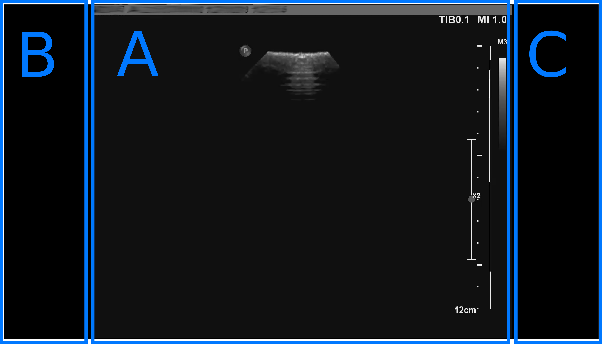

# GUI Plug-in


# Summary

This plug-in integrates and organises widgets from previous plug-ins to display information and images in real time to the user. The organisation of the visualization window in shown below:



The central frame (A) displays the images from a given stream in real time. The side frames (B and C) can be used to display widgets from individual plugins upstream the pipeline. 

## Usage

```bash
# PLUGIN GUI
   Displays imaging and non-imaging data in real time.
	--gui_framerate <val> [ type: FLOAT]	Frame rate at which the plugin does the work. (Default: 20) 
	--gui_verbose <val> [ type: BOOL]	Whether to print debug information (1) or not (0). (Default: 0) 
	--gui_time <val> [ type: BOOL]	Whether to measure execution time (1) or not (0). (Default: 0) 
```

