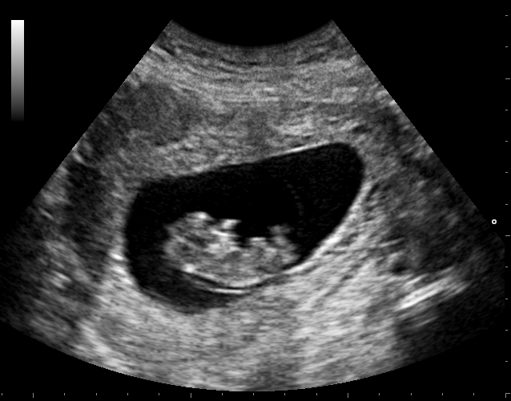

# Python Algorithm Plug-in (a tutorial)


# Summary

This plug-in carries out a simple image processing task in Python, by using the C++ to Python bindings provided by [PyBind11](https://github.com/pybind/pybind11). This plug-in is provided as a tutorial exemplifying how to write python based plug-ins for PRETUS. This readme describes the process of creating the plug-in including the processing itself and a visualization widgets for the results.

The task of choice is a simple image blurring task based on SimpleITK, and an additional user-defined wait time that can be used to check frame-drops and parallel running.

*Note: a limitation of the current system is that PRETUS cannot use for a plugin opencv in Python. Any Opencv related tasks must be implemented in C++.*

*Note: it is recommended that the sample plugin CppAlgorithm is checked first, since it is more simple.*


# 1. Set up the files

A basic plug-in will needs one class (the plugin itself) and optionally three more classes: the worker (if the taask is to be done in a separate thread, or at a certain interval), and the two widgets: one for the metadata, and one for images. In this case we will implement all four. In addition, plug-ins need a `CMakeLists.txt` config file, and in this case this file will require python specific configuration. Also, to set up the python folders we need to implement the `plugin_PythonAlgorithm_config.h.in` file. In summary we need to implement:

* The `plugin_PythonAlgorithm_config.h.in` file. This is needed to locate the folder where the python files are. The other files are common to the non
* `CMakeLists.txt` file.
* Class `Plugin_CppAlgorithm` will inherit from `Plugin` and manage argument passing, plugin initialization and configuration.
* Class `Worker_CppAlgorithm` will inherit from `Worker` and will carry out the processing task on a separate thread. This class is not required if the task does not need a separate thread and is simple enough to be incorporated into the `Plugin` class.
* Class `Widget_CppAlgorithm` will implement the widget where results and information about the plug-in are shown.
* For the image widget we will use the provided `QtVTKVisualization` class that performs basic image and overlay visualization.

# 2. The `plugin_PythonAlgorithm_config.h.in` file.

This file wil provide the folder where the python sources wil be installed to via the `PythonAlgorithm::getPythonFolder()` function, so that these can be imported from C++.

```cpp
// the configured options and settings for Plugin python
#ifndef PLUGIN_PYTHONALGORITHM_PYTHON_FOLDER
#define PLUGIN_PYTHONALGORITHM_PYTHON_FOLDER @PYTHON_INSTALL_PATH@

namespace PythonAlgorithm {

char * getPythonFolder()
{
    return "@PYTHON_INSTALL_PATH@";
}

}

#endif // PLUGIN_PYTHONALGORITHM_PYTHON_FOLDER

```

# 3. The `CMakeLists.txt` file

The CMake file needs to include the following to set up Python:

```
# For python stuff
set(Python_ADDITIONAL_VERSIONS 3.6)
find_package(PythonLibs 3.0  REQUIRED)
include_directories(${PYTHON_INCLUDE_DIRS})

find_package(pybind11 REQUIRED)
if(pybind11_INCLUDE_DIR)
    include_directories(${pybind11_INCLUDE_DIR})
else()
    message(FATAL "Cannot find PYBIND11 include files. Please install/download PyBind11 at https://github.com/pybind/pybind11")
endif()

get_filename_component(PYTHON_FOLDERS ${CMAKE_CURRENT_LIST_DIR} NAME)
set(SCRIPT_INSTALL_PATH "${PLUGIN_SCRIPT_INSTALL_PREFIX}/")
set(PYTHON_INSTALL_PATH "${SCRIPT_INSTALL_PATH}${PYTHON_FOLDERS}")
configure_file( plugin_PythonAlgorithm_config.h.in ${CMAKE_BINARY_DIR}/generated/plugin_PythonAlgorithm_config.h )

```

Then we need to indicate where the pytthon files are. In this case we implement two: the `worker.py` file, where the actual processing happens, and the `demo.py` (optional) which we can use to run our python code offline. Both files will be in the `python` subfolder within the plugin folder, although this is not a requirement.

```
set(PYTHON_FILES
    python/demo.py
    python/worker.py
    )

file(GLOB SOURCES "*.h" "*.cxx")

add_library(Plugin_PythonAlgorithm "${PROJECT_BUILD_TYPE}"
    ${SOURCES}
    # python stuff
    ${PYTHON_FILES}
    )

target_link_libraries(Plugin_PythonAlgorithm
    Plugin
    Qt5::Widgets
    Qt5::Core # need this for QT signal/slot system
    Qt5::Widgets
    ${PYTHON_LIBRARIES}
    ${Boost_LIBRARIES}
    ${ITK_LIBRARIES}
    ${VTK_LIBRARIES}
    ${pybind11_LIBRARIES}
    )
```

Lasdt, in the CMake we need to configure where these files will install to. We can do this as follows:

```
install( DIRECTORY python/  DESTINATION "${SCRIPT_INSTALL_PATH}/${PYTHON_FOLDERS}" )
```

This concludes the additional CMake configuration. Please refer to the entire `CMakeLists.txt` for full detail.


# 4. Implementing the `Plugin_PythonAlgorithm` class

Here we will describe the differences with respect to the`Plugin_CppAlgorithm` class. The class header is no different, so we will focus on the implementation. First, we need to include the `#include <generated/plugin_PythonAlgorithm_config.h>` header, which contains the path to the python folder. Then, in the constructor, we need to set this folders in the worker:

```cpp
// Construct the worker
    {
        WorkerType::Pointer worker_ = WorkerType::New();
        worker_->python_folder = std::string(PythonAlgorithm::getPythonFolder());
        this->worker = worker_;
    }
```


The visualization in this case is the Gaussian blurred image, so we configure the `ImageWidget` object to display only the corresponding layer:

```cpp
 {
        // create image widget
        ImageWidgetType * mWidget_ = new ImageWidgetType;
        this->mImageWidget = mWidget_;
        this->mImageWidget->SetStreamTypes(ifind::InitialiseStreamTypeSetFromString(this->GetCompactPluginName().toStdString()));
        this->mImageWidget->SetWidgetLocation(ImageWidgetType::WidgetLocation::hidden); // by default, do not show

        // set image viewer default options:
        // overlays, colormaps, etc
        ImageWidgetType::Parameters default_params = mWidget_->Params();
        default_params.SetBaseLayer(1); // use the input image as background image
        mWidget_->SetParams(default_params);

    }
```

The next difference is in the `Initialize()` function. Because this plug-in may be the first using python in the pipeline, we need to tell other plug-ins downstream that the python interpreter has been initialized (because it will be shared across plug-ins). To this end, we send a configuration message:

```cpp
void Plugin_PythonAlgorithm::Initialize(void){

    Plugin::Initialize();
    reinterpret_cast< ImageWidgetType *>(this->mImageWidget)->Initialize();
    this->worker->Initialize();

    ifind::Image::Pointer configuration = ifind::Image::New();
    configuration->SetMetaData<std::string>("PythonInitialized",this->GetPluginName().toStdString());
    Q_EMIT this->ConfigurationGenerated(configuration);

    this->Timer->Start(this->TimerInterval);
}
```

At the same time, this plug-in may not be the first to use python, so we listen to any upcoming config message coming from upstream to see if python has been already initialized:

```cpp
void Plugin_PythonAlgorithm::slot_configurationReceived(ifind::Image::Pointer image){
    if (image->HasKey("PythonInitialized")){
        std::string whoInitialisedThePythonInterpreter = image->GetMetaData<std::string>("PythonInitialized");
        std::cout << "[WARNING from "<< this->GetPluginName().toStdString() << "] Python interpreter already initialized by \""<< whoInitialisedThePythonInterpreter <<"\", no initialization required."<<std::endl;
        this->worker->setPythonInitialized(true);
    }

    if (image->HasKey("Python_gil_init")){
        std::cout << "[WARNING from "<< this->GetPluginName().toStdString() << "] Python Global Interpreter Lock already set by a previous plug-in."<<std::endl;
        this->worker->set_gil_init(1);
    }
    /// Pass on the message in case we need to "jump" over plug-ins
    Q_EMIT this->ConfigurationGenerated(image);
}
```

Apart for these, setting up this plugin class is the same as for the `CppAlgorithm` class.


# 5. Implementing the `Worker_PythonAlgorithm` class

The `Worker_PythonAlgorithm` will communicate with the python code, so it needs to do a number of things. First, we will use at least two functions in python: a function to initialize the python variables (optional), and a function to call the processing in python. To this end, we need to define two python function pointers in the header, and three variable to store the `sigma` of the Gaussian, the wait delay in seconds, and the python folder:

```cpp
...
#include <pybind11/pybind11.h>
namespace py = pybind11;


class Worker_PythonAlgorithm : public Worker{
    Q_OBJECT

public:
...
double mFsigma;
double mDelay;
std::string python_folder;
...
public Q_SLOTS:

    virtual void slot_sigmaValueChanged(int v);
...
private:

    /// Python Functions
    py::object PyImageProcessingFunction;
    py::object PyPythonInitializeFunction;

```


In the implementation, we need to include some extra `pybind11` headers:

```cpp
#include <pybind11/embed.h>
#include <pybind11/numpy.h>
```

And implement the destructor:
```cpp
Worker_PythonAlgorithm::~Worker_PythonAlgorithm(){
    py::finalize_interpreter();
}
```

As a difference with the `CppAlgorithm` worker, here we do need the `Initialize()` function, to set up the python interpreter, import the folders where the python code is, and if needed call python initialization function:

```cpp
void Worker_PythonAlgorithm::Initialize(){

    if (!this->PythonInitialized){
        try {
            py::initialize_interpreter(); // this will call Py_Initialize();
        }
        catch (py::error_already_set const &pythonErr) {
            std::cout << pythonErr.what();
        }
    }

    PyGILState_STATE gstate = PyGILState_Ensure();
    {

        py::exec("import sys");
        std::string command = "sys.path.append('" + this->python_folder + "')";
        py::exec(command.c_str());

        py::object processing = py::module::import("worker");
        /// Check for errors
        if (PyErr_Occurred())
        {
            PyErr_Print();
            return;
        }

        /// grabbing the functions from module
        this->PyImageProcessingFunction = processing.attr("dowork");
        this->PyPythonInitializeFunction = processing.attr("initialize");
        this->PyPythonInitializeFunction(this->python_folder);
        this->PythonInitialized = true;
    }
    PyGILState_Release(gstate);
}
```

The `DoWork()` function also needs to implement a number of different things. First, we need to check if the python interpreter is active, and activate it if not:

```cpp
void Worker_PythonAlgorithm::doWork(ifind::Image::Pointer image){

    if (!this->PythonInitialized){
        if (this->params.verbose){
            std::cout << "Worker_PythonAlgorithm::doWork() - python not initialised" <<std::endl;
        }
        return;
    }

    if (!Worker::gil_init) {
        if (this->params.verbose){
            std::cout << "Worker_PythonAlgorithm::doWork() - init GIL" <<std::endl;
        }
        Worker::gil_init = 1;
        PyEval_InitThreads();
        PyEval_SaveThread();

        ifind::Image::Pointer configuration = ifind::Image::New();
        configuration->SetMetaData<std::string>("Python_gil_init","True");
        Q_EMIT this->ConfigurationGenerated(configuration);
    }

    if (image == nullptr){
        if (this->params.verbose){
            std::cout << "Worker_PythonAlgorithm::doWork() - input image was null" <<std::endl;
        }
        return;
    }
```

After that,we can start the actual processing task. To ensure that images are 2D, we extract the central slice (if input image was 2D, it remains unchanged but if it was 3D, then the central slice is used). We will need the new size to create a numpy image afterwards.

```cpp
/// Extract central slice
GrayImageType2D::Pointer image_2d = this->get2dimage(image);

std::vector <unsigned long> dims = {image_2d->GetLargestPossibleRegion().GetSize()[1],
                                        image_2d->GetLargestPossibleRegion().GetSize()[0]};
```


We then implement the task and the python call within a `PyGILState` environment, where the basic structure is:

```cpp
    PyGILState_STATE gstate = PyGILState_Ensure();
    {
		/// Do processing task and call python
		...
		...
    }
    PyGILState_Release(gstate);
```


In particular, in this plug in, the processing is done by the lines:

```cpp
  py::object _function = this->PyImageProcessingFunction;
  py::array result = py::array(_function(numpyarray, this->mFsigma, this->mDelay, this->params.verbose));
```

The surrounding lines ensure that data is converted to and from python properly, and that the result is incorporated to the input image and transmitted. In full:


```cpp
    PyGILState_STATE gstate = PyGILState_Ensure();
    {
        if (this->params.verbose){
            std::cout << "Worker_PythonAlgorithm::doWork() - within PyGILState_Ensure;" <<std::endl;
        }
        py::array numpyarray(dims, static_cast<GrayImageType2D::PixelType*>(image_2d->GetBufferPointer()));
        py::object _function = this->PyImageProcessingFunction;

        py::array result = py::array(_function(numpyarray, this->mFsigma, this->mDelay, this->params.verbose));

        /// convert the result to a itk image
        typedef itk::ImportImageFilter< GrayImageType::PixelType, 2 >   ImportFilterType;
        ImportFilterType::SizeType imagesize;

        imagesize[0] = result.shape(1);
        imagesize[1] = result.shape(0);

        ImportFilterType::IndexType start;
        start.Fill(0);
        ImportFilterType::RegionType region;
        region.SetIndex(start);
        region.SetSize(imagesize);

        /// Define import filter
        ImportFilterType::Pointer importer = ImportFilterType::New();
        importer->SetOrigin( image_2d->GetOrigin() );
        importer->SetSpacing( image_2d->GetSpacing() );
        importer->SetDirection( image_2d->GetDirection() );
        importer->SetRegion(region);
        /// Separate the regional scalar buffer
        GrayImageType::PixelType* localbuffer = static_cast<GrayImageType::PixelType*>(result.mutable_data());
        /// Import the buffer
        importer->SetImportPointer(localbuffer, imagesize[0] * imagesize[1], false);
        importer->Update();

        /// Disconnect the output from the filter
        output_2d = importer->GetOutput();
        output_2d->DisconnectPipeline();

        output_2d->SetMetaDataDictionary(image_2d->GetMetaDataDictionary());

        /// Create a 3D image with the 2D slice
        GrayImageType::Pointer output = this->get3dimagefrom2d(output_2d);

        /// Finally add to the image before emitting it.
        image->GraftOverlay(output.GetPointer(), image->GetNumberOfLayers());
        image->SetMetaData<std::string>( this->mPluginName.toStdString() +"_output", QString::number(image->GetNumberOfLayers()).toStdString() );
        image->SetMetaData<std::string>(this->mPluginName.toStdString() + "_sigma",  QString::number(this->mFsigma).toStdString());
        image->SetMetaData<std::string>(this->mPluginName.toStdString() + "_delay",  QString::number(this->mDelay).toStdString());
    }
    PyGILState_Release(gstate);
    Q_EMIT this->ImageProcessed(image);
```


# 6. The python code

The workers imports the `worker.py` python file, which in this example has two fuctions: `initialize` (which here does not really do much, just print the python folder, and could be omitted), and `dowork`, which is the main task function and does the blurring and wait. The whole python file is:

```python

# Dependencies
import os, sys, numpy as np
import time

import SimpleITK as sitk

def initialize( python_path):
    print("worker.py: Initialize: the python folder is : " + python_path)


def dowork(image_cpp, fsigma=1.0, delay_sec=0, verbose=False):
    """
    image_cpp is theinput image (a numpy array)
    fkernel is the kernel size for the Gaussian
    fsigma is the Gaussian width
    verbose allows to print extra info
    """
    try:

        time.sleep(delay_sec)
        im = sitk.GetImageFromArray(image_cpp)
        pixelID = im.GetPixelID()
        gaussian = sitk.SmoothingRecursiveGaussianImageFilter()
        gaussian.SetSigma(fsigma)
        output = gaussian.Execute(im)

        caster = sitk.CastImageFilter()
        caster.SetOutputPixelType(pixelID)
        output = caster.Execute(output)

        output_np = sitk.GetArrayFromImage(output)
        return output_np

    except Exception as inst:
        print("::WARNING:: pythonalgorithm detected an exception")
        print(type(inst))    # the exception instance
        print(inst.args)     # arguments stored in .args
        print(inst)          # __str__ allows args to be printed directly,
        return defaultret

```


# 7. The `Widget_PythonAlgorithm` class


For this plug-in, similarly to the `Plugin_CppAlgorithm` the widget will show the user what is the sigma and delay being used, and allow to change the sigma with a slider. The reader is referred to that plug-in and to the source code for an example.

# 8. Using the `PythonAlgorithm` plugin

To test the plug-in within PRETUS, we build a simple pipeline where we read a video from file, apply the blurring, and visualize the results. To this end we use, in this order, the `video manager` plug-in, the `Python Algorithm` plug-in, and the `GUI` plug-in, which have numbers 2, 4 and 5 respectively. These numbers may change depending on the build so the user should check by typing `pretus -h`. Then we call PRETUS as follows:

```
./bin/pretus -pipeline "2>4>5"  --videomanager_input /home/username/videos/video.MP4  --pythonalgorithm_sigma 10  --videomanager_showimage 1 --pythonalgorithm_showimage 1
```

An animation of the result is shown in the figure below. The program can be closed by entering `quit` in the command line.


# 9. A standalone Python executable for testing

It is good practice to add a python executable that calls ``worker.py` to check the processing offline. To this end, we implement `demo.py` which applies the task (blurring and wait) on an image read from file. The code is:

```python
import sys, getopt, numpy as np
import cv2
import worker

def image_loader(image_name):
    """load image, returns numpy tensor"""
    image = cv2.imread(image_name)
    image= cv2.cvtColor(image, cv2.COLOR_RGB2GRAY)

    return image

def main(argv):

    inputfile = ''
    outputfile = ''
    try:
        opts, args = getopt.getopt(argv,"hi:o:s:d:")
    except getopt.GetoptError:
        print('test.py -i <inputfile> -o <outputfile> -s <sigma in mm> -d <delay in sec>')
        sys.exit(2)
    if len(opts) < 4:
        print('Too few arguments {:d} found'.format(len(opts) ))
        print('test.py -i <inputfile> -o <outputfile> -s <sigma in mm> -d <delay in sec>')
        sys.exit(2)
    for opt, arg in opts:
        if opt == '-h':
            print('test.py -i <inputfile> -o <outputfile> -s <sigma in mm> -d <delay in sec>')
            sys.exit()
        elif opt in ("-i"):
            inputfile = arg
        elif opt in ("-o"):
            outputfile = arg
        elif opt in ("-s"):
            sigma = float(arg)
        elif opt in ("-d"):
            delay = float(arg)

    print('Input file is '+ inputfile)
    print('Output file is '+ outputfile)
    print('Sigma is {}'.format(sigma))
    print('Delay is {}'.format(delay))

    im_file = 'test_image.png'
    out_file = 'test_image_processed.png'

    # Load Testing image
    image = image_loader(inputfile)

    worker.initialize('this is the python folder')

    output = worker.dowork(image, sigma, delay)

    cv2.imwrite(outputfile, output)

if __name__ == '__main__':
    main(sys.argv[1:])


```

And can be called as follows:

```bash
python demo.py -i test_image.png -o test_image_processed.png -s 10 -d 1
```

with the following input and output examples:

Input:


Output: